<h1 align="center">Hi 👋, I'm Muhammed Yahiya</h1>
<h3 align="center">Full-Stack Developer | Python & MERN Stack | GraphQL</h3>

  

  
  

---

## 👨‍💻 About Me

- 🎓 B.Tech in Information Technology from **Cochin University of Science and Technology** (2021–2025)
- 💼 Currently working as a **Full Stack Developer at Deelo**, building with **Next.js, Node.js, GraphQL & MongoDB**
- 🏗️ Previously contributed to **DevLift** at ReGoBs Technology and built full-stack apps at **Global Invisions**
- 🧰 Experienced with **FastAPI + PostgreSQL + Next.js** and **Node.js + Express + MongoDB**
- 🔬 Worked on **deep learning** projects — plant disease detection with PyTorch, microgrid demand prediction on embedded hardware
- 🌱 Currently exploring **scalable app architecture** and **vibe engineering**
- 🧠 Passionate about **clean code**, **API design**, and **learning by building**

  
  
  

---

## 💼 Experience

| Role                              | Company           | Period              | Stack                              |
| --------------------------------- | ----------------- | ------------------- | ---------------------------------- |
| **Full Stack Developer**          | Deelo             | Jan 2026 – Present  | Next.js, Node.js, GraphQL, MongoDB |
| **Full Stack Developer**          | ReGoBs Technology | May 2025 – Dec 2025 | Full-Stack (DevLift Product)       |
| **Software Development Engineer** | Global Invisions  | Jun 2022 – Oct 2022 | Full-Stack, REST APIs              |

---

## 🛠 Tech Stack

**Languages**

**Backend**

**Frontend**

**Database**

**Cloud**

**ML / AI**

**Tools & Platforms**

---

## 🚀 Featured Projects

| Project                                                                                                      | Description                                                                             | Tech                        |
| ------------------------------------------------------------------------------------------------------------ | --------------------------------------------------------------------------------------- | --------------------------- |
| [**Elixir**](https://github.com/MuhammedYahiya/Elixir)                                                       | Hospital Management System with JWT auth, RBAC, and Cloudinary integration              | Node.js, MongoDB, REST APIs |
| [**Medicinal Plant Disease Detection**](https://github.com/MuhammedYahiya/Medicinal-Plant-Disease-Detection) | Deep learning system using fine-tuned MobileNetV2 for leaf disease classification       | Python, PyTorch, Flask      |
| [**MicroGrid Demand System**](https://github.com/MuhammedYahiya/MicroGrid-Bit_Generation)                    | Neural network for EV charging station microgrid demand prediction, deployed on PYNQ Z1 | Python, PyTorch, FINN       |
| [**Database Backup CLI**](https://github.com/MuhammedYahiya/Database-Backup-CLI)                             | CLI tool to backup/restore MySQL, PostgreSQL, MongoDB & SQLite databases                | Python                      |
| [**Python Networking Toolkit**](https://github.com/MuhammedYahiya/Python-Networking-Toolkit)                 | Netcat clone for remote command execution, TCP client/server, port scanner              | Python, Sockets             |

---

## 🐍 Contribution Snake

<picture>
  <source media="(prefers-color-scheme: dark)" srcset="https://raw.githubusercontent.com/MuhammedYahiya/MuhammedYahiya/output/github-contribution-grid-snake-dark.svg" />
  <source media="(prefers-color-scheme: light)" srcset="https://raw.githubusercontent.com/MuhammedYahiya/MuhammedYahiya/output/github-contribution-grid-snake.svg" />
  
</picture>

---

## 💬 Random Dev Quote

  

---

## 📈 GitHub Stats

  
  

  

  

---

  <b>⭐ If you find my work useful, consider giving a star!</b>  
  <img src="https://capsule-render.vercel.app/api?type=waving&color=gradient&customColorList=6,11,20&hei
